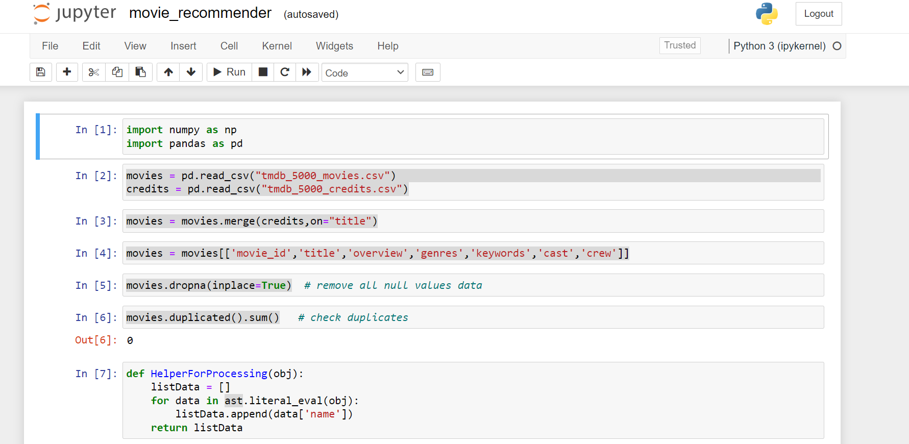

# Movie Recommender

This is a movie recommendation system that takes a movie name as input and returns recommended movies.

## Images


## Getting Started

To use this movie recommender system, follow these steps:

1. Clone the repository to your local machine.
2. Install the required dependencies from `requirements.txt`.

3. Run Jupyter Notebook First
``` python []
jupyter notebook  # run command in terminal 
```

Run all cell one bye one in jupyter notebook, get `movies.pkl` and `similarity.pkl` file

Run app file
``` python3 []
streamlit run app.py #
```

## Jupyter Notebook

import Dataset files

Use [TMDB 5000 Movie](https://www.kaggle.com/datasets/tmdb/tmdb-movie-metadata) Dataset


``` python3 []
movies = pd.read_csv("tmdb_5000_movies.csv")
credits = pd.read_csv("tmdb_5000_credits.csv")
```

### Merge the two dataframes using `title`
``` python3 []
movies = movies.merge(credits,on="title")
```

### Drop unnecessary columns
``` python3 []
movies = movies.drop(columns=["homepage","title_x","title_y","status","production_countries"])
```

### Remove all rows with null values
``` python3 []
movies.dropna(inplace=True)
```

### Check duplicates
``` python3 []
movies.duplicated().sum()
```

### Helper function to get the director's name

``` python3 []
def getDirector(obj):
    listdata = []
    for data in ast.literal_eval(obj):
        if data['job'] == 'Director':
            listdata.append(data['name'])
            break
    return listdata
```

### Helper function to get names from keywords, genres, cast, crew

``` python3 []
def HelperForProcessing(obj):
    listData = []
    for data in ast.literal_eval(obj):
        listData.append(data['name'])
    return listData
```

### Get 5 cast members
``` python3 []
def get5Cast(obj):
    listData = []
    temp = 0
    for data in ast.literal_eval(obj):
        if temp > 5:
            break
        listData.append(data['name'])
        temp+=1
    return listData
```

### Change movies all data
``` python3 []
movies['genres'] = movies['genres'].apply(HelperForProcessing)
movies['keywords'] = movies['keywords'].apply(HelperForProcessing)
movies['cast'] = movies['cast'].apply(get5Cast)

movies['crew'] = movies['crew'].apply(getDirector)
movies['overview'] = movies['overview'].apply(lambda x: x.split())
```

### Remove spaces
``` python3 []
movies['genres'] = movies['genres'].apply(lambda x:[i.replace(" ","") for i in x])
movies['keywords'] = movies['keywords'].apply(lambda x:[i.replace(" ","") for i in x])
movies['cast'] = movies['cast'].apply(lambda x:[i.replace(" ","") for i in x])
movies['crew'] = movies['crew'].apply(lambda x:[i.replace(" ","") for i in x])
```

### Merge all the columns
``` python3 []
movies['tags'] = movies['overview'] + movies['genres']+ movies['keywords'] + movies['cast'] + movies['crew']
```

### Take only the title, movie_id and tags column
``` python3 []
data_frame = movies[['movie_id','title','tags']]
```

### Convert the tags column to string
``` python3 []
data_frame['tags'] = data_frame['tags'].apply(lambda x:" ".join(x))
```

### Data stemming function
``` python3 []
def stem(text):
    data = []
    for word in text.split():
        data.append(ps.stem(word))
    
    return " ".join(data)
```

### Apply stemming to the tags column
``` python3 []
data_frame['tags'] = data_frame['tags'].apply(stem)
```

### Convert tags in lower case
``` python3 []
data_frame['tags'] = data_frame['tags'].apply(lambda x: x.lower())
```

#### Create vectors for the tags column
``` python3 []
vectors = cv.fit_transform(data_frame['tags']).toarray()
similarity = cosine_similarity(vectors)
```

#### Helper function to get the recommended movies
``` python3 []
def recommended(movie):
    movie_index = data_frame[data_frame['title'] == movie].index[0]
    distance = similarity[movie_index]
    movies_list = sorted(list(enumerate(distance)),reverse=True,key=lambda x: x[1])[1:6]
    
    for i in movies_list:
        print(data_frame.iloc[i[0]].title)

```
#### Call function 
``` python3 []

recommended('Batman Begins')

# output 
The Dark Knight
Batman
Batman
The Dark Knight Rises
Rockaway
```
## Usage

To get movie recommendations, provide the name of a movie as input. The system will then generate a list of recommended movies based on the input.
